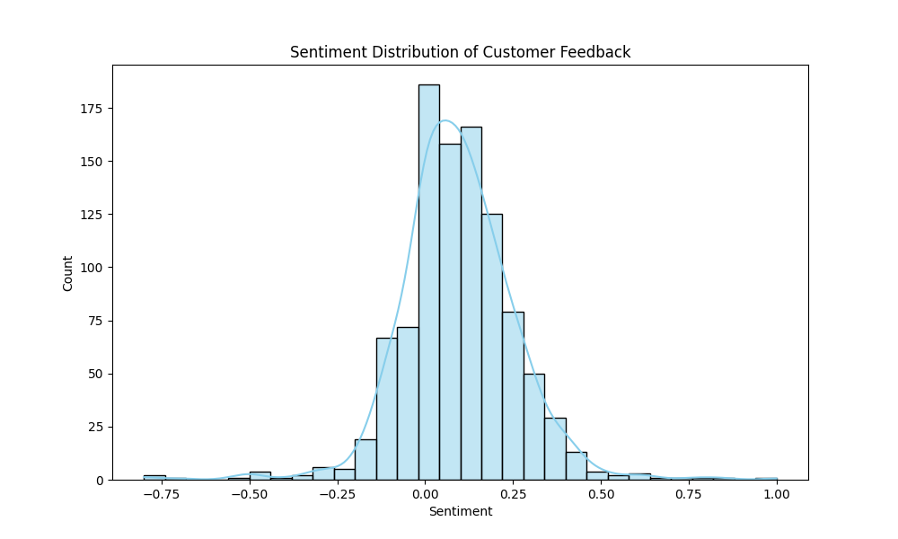

# Customer Feedback Analysis Project



## Project Overview

This project involves analyzing customer feedback for a regional retail chain to identify areas for improvement. The analysis includes cleaning and preprocessing the feedback data, performing sentiment analysis, identifying common themes using topic modeling, and visualizing the results.

## Directory Structure

```
customer_feedback_analysis/
├── sentiment_analysis_env/     # Virtual environment directory
├── data/                       # Directory to store data files
│   ├── raw_feedback.csv        # Raw customer feedback data file
│   ├── cleaned_feedback.csv    # Cleaned feedback data file
│   └── sentiment_feedback.csv  # Feedback data with sentiment analysis
├── results/                    # Directory to store analysis results
│   ├── rating_distribution.png # Distribution of customer ratings
│   ├── average_monthly_ratings.png # Average monthly ratings over time
│   ├── topics.csv              # CSV file with LDA topic modeling results
│   ├── topic_0_wordcloud.png   # Word cloud for Topic 0
│   ├── topic_1_wordcloud.png   # Word cloud for Topic 1
│   ├── topic_2_wordcloud.png   # Word cloud for Topic 2
│   ├── topic_3_wordcloud.png   # Word cloud for Topic 3
│   ├── topic_4_wordcloud.png   # Word cloud for Topic 4
│   └── project_summary.txt     # Summary of the project
├── logs/                       # Directory to store logs (if any)
├── src/                        # Source directory for Python scripts
│   ├── data_generation.py      # Script to generate synthetic feedback data
│   ├── data_preprocessing.py   # Script to preprocess and clean data
│   ├── sentiment_analysis.py   # Script to perform sentiment analysis
│   ├── exploratory_data_analysis.py # Script to perform exploratory data analysis
│   ├── thematic_analysis.py    # Script to perform topic modeling
│   ├── data_visualization.py   # Script to visualize data
├── setup.py                    # Script to initialize libraries and download NLTK data
└── completion_note.py          # Script to summarize the project
```

## Setup Instructions

1. **Clone the repository:**

```bash
git clone https://github.com/yourusername/customer_feedback_analysis.git
cd customer_feedback_analysis
```

2. **Set up the virtual environment:**

```bash
python -m venv sentiment_analysis_env
source sentiment_analysis_env/bin/activate   # On Windows use `sentiment_analysis_env\Scripts\activate`
```

3. **Install the required packages:**

```bash
python setup.py
```

## Running the Scripts

### 1. Generate Synthetic Data

```bash
python src/data_generation.py
```

### 2. Preprocess Data

```bash
python src/data_preprocessing.py
```

### 3. Perform Sentiment Analysis

```bash
python src/sentiment_analysis.py
```

### 4. Exploratory Data Analysis

```bash
python src/exploratory_data_analysis.py
```

### 5. Thematic Analysis

```bash
python src/thematic_analysis.py
```

### 6. Data Visualization

```bash
python src/data_visualization.py
```

### 7. Project Summary

```bash
python completion_note.py
```

## Results

- **Rating Distribution**: `results/rating_distribution.png`
- **Average Monthly Ratings**: `results/average_monthly_ratings.png`
- **Topics CSV**: `results/topics.csv`
- **Word Clouds for Topics**: `results/topic_0_wordcloud.png`, `results/topic_1_wordcloud.png`, etc.
- **Project Summary**: `results/project_summary.txt`

## Project Summary

The project involves analyzing customer feedback data to derive actionable insights. The main steps include:

1. **Data Generation**: Generating synthetic feedback data for analysis.
2. **Data Preprocessing**: Cleaning and preparing the data for analysis.
3. **Sentiment Analysis**: Analyzing the sentiment of customer feedback.
4. **Exploratory Data Analysis**: Visualizing the distribution of ratings and feedback over time.
5. **Thematic Analysis**: Identifying common themes using Latent Dirichlet Allocation (LDA).
6. **Data Visualization**: Creating word clouds for each topic to visualize common themes.
7. **Project Summary**: Summarizing the findings and providing recommendations based on the analysis.

The recommendations based on the analysis are:
- Focus on improving areas identified as negative in sentiment analysis.
- Enhance services related to the most frequent terms in positive feedback.
- Regularly monitor customer feedback to track changes in sentiment over time.

## License

This project is licensed under the MIT License.
```